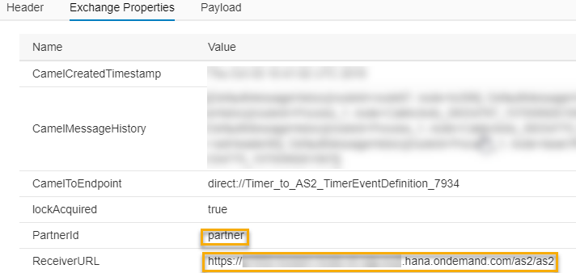

# Accessing Partner Directory entries from within a Groovy script

\| [Recipes by Topic](../../readme.md ) \| [Recipes by Author](../../author.md )\| [Request Enhancement](https://github.com/SAP-samples/cloud-integration-flow/issues/new?assignees=&labels=Recipe%20Fix,enhancement&template=recipe-request.md&title=Improve%20Accessing%20Partner%20Directory%20entries%20from%20within%20a%20Groovy%20script) \| [Report a bug](https://github.com/SAP-samples/cloud-integration-flow/issues/new?assignees=&labels=Recipe%20Fix,bug&template=bug_report.md&title=Issue%20with%20Accessing%20Partner%20Directory%20entries%20from%20within%20a%20Groovy%20script) \| [Fix documentation](https://github.com/SAP-samples/cloud-integration-flow/issues/new?assignees=&labels=Recipe%20Fix,documentation&template=bug_report.md&title=Docu%20fix%20Accessing%20Partner%20Directory%20entries%20from%20within%20a%20Groovy%20script) \|

|[Amrita Laxmi](https://github.com/amritalaxmi )|
----|----|

The String and Binary parameters from the Partner Directory can be accessed using a script with the help of getParameter API of the PartnerDirectoryService class.

[Download the sample integration flow](AccessingPDEntries.zip)

## Recipe

Step|Code|Why?
----|----|----
Import classes | ```com.sap.it.api.pd.PartnerDirectoryService``` |
Get the access to the PartnerDirectoryService | ```def service = ITApiFactory.getApi(PartnerDirectoryService.class, null);``` |
Retrieve the String Parameter| ```def parameterValue = service.getParameter("ReceiverURL", partnerId , String.class);```| Fetches the Receiver address from the parameter Id 'ReceiverURL' and Partner Id that is available in the Partner Directory
Retrieve the Binary Parameter and store it in a header | ```message.setHeader("xsltmappingname","pd:"+partnerId+":xsltmapping:Binary");```| Fetches the Partner Directory URI for accessing the XSL Transformation and stores it in header 'xsltmappingname'

## References
[Parameterizing Integration Flows Using the Partner Directory](https://help.sap.com/viewer/368c481cd6954bdfa5d0435479fd4eaf/Cloud/en-US/b7812a546ab14de6aa0a7c919d8272bb.html/)\
[Cloud Integration - Partner Directory - Step-by-Step Example](https://blogs.sap.com/2017/07/25/cloud-integration-partner-directory-step-by-step-example/)\
[Cloud Integration - Partner Directory - Partner Dependent XML Structures and IDs](https://blogs.sap.com/2017/08/22/cloud-integration-partner-directory-partner-dependent-xml-structures-and-ids/)

## Sample integration flow
We have a scheduler set at 'Run Once'. A Content Modifier to initialize the Partner ID in a property 'PartnerId' and a script to access the String and Binary parameters for this Partner ID. The AS2 receiver and XSLT mapping validates the fetched parameters.\


[Download the sample integration flow](AccessingPDEntries.zip)

### Sample Script
This is the script used in this sample
``` import com.sap.gateway.ip.core.customdev.util.Message;
import java.util.HashMap;
import com.sap.it.api.pd.PartnerDirectoryService;
import com.sap.it.api.ITApiFactory;
def Message processData(Message message) {
       def service = ITApiFactory.getApi(PartnerDirectoryService.class, null);
       if (service == null){
          throw new IllegalStateException("Partner Directory Service not found");
       }
       def map = message.getProperties();
       def partnerId = map.get("PartnerId");
       if (partnerId == null){
          throw new IllegalStateException("Partner ID is not set in the property 'PartnerId'")      
       }
       def parameterValue = service.getParameter("ReceiverURL", partnerId , String.class);
       if (parameterValue == null){
        throw new IllegalStateException("URL parameter not found in the Partner Directory for the partner ID "+partrnerId);      
        }

        message.setProperty("ReceiverURL", parameterValue );

        //reading the Binary parameter
        message.setHeader("xsltmappingname","pd:"+partnerId+":xsltmapping:Binary");

        return message;
}
```

### Sample Output
Set Property and Header read from Partner Directory is printed for the given source value.\
\



