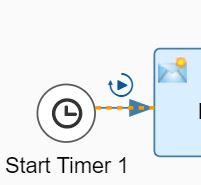
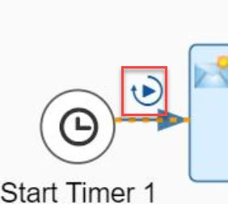
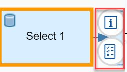
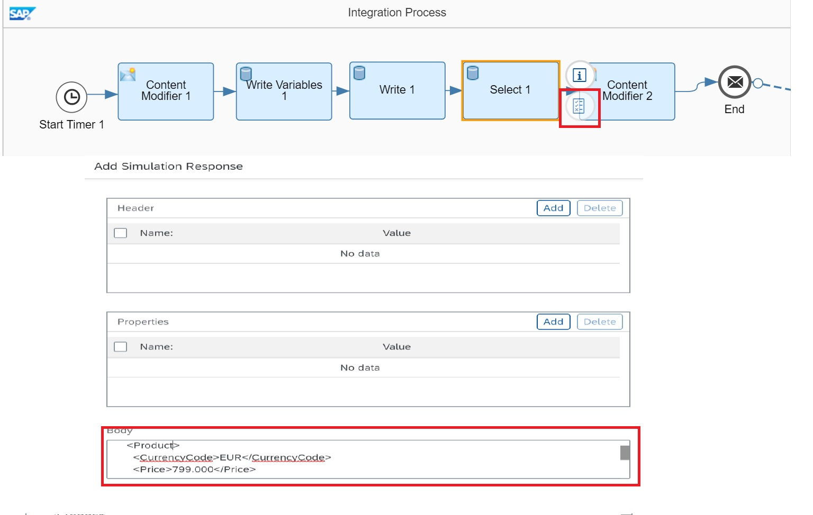
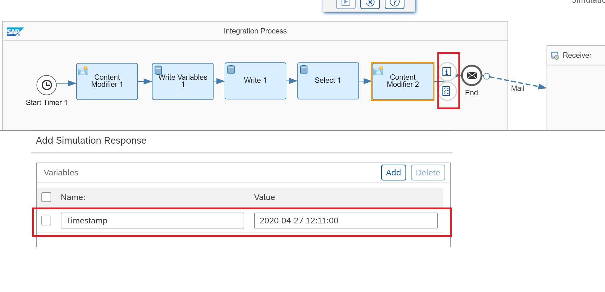

# Simulate Response from Datastore  Select Operation and  Write Variable
\| [Recipes by Topic](../../readme.md ) \| [Recipes by Author](../../author.md ) \| [Request enhancement](https://github.com/SAP-samples/cloud-integration-flow/issues/new?assignees=&labels=Recipe%20Fix,enhancement&template=recipe-request.md&title=Improve%20Simulate%20Response%20from%20Datastore%20Select%20Operation%20and%20Write%20Variable) \| [Report a bug](https://github.com/SAP-samples/cloud-integration-flow/issues/new?assignees=&labels=Recipe%20Fix,bug&template=bug_report.md&title=Issue%20with%20Simulate%20Response%20from%20Datastore%20Select%20Operation%20and%20Write%20Variable) \| [Fix documentation](https://github.com/SAP-samples/cloud-integration-flow/issues/new?assignees=&labels=Recipe%20Fix,documentation&template=bug_report.md&title=Docu%20fix%20Simulate%20Response%20from%20Datastore%20Select%20Operation%20and%20Write%20Variable) \|

|[Abhinav Verma](https://github.com/abhinavverma0501)|
----|----|

Use this recipe to
* Simulate reading of Write Variable in Content Modifer
* Simulate the Datastore Select Operation.  

[Download the integration flow sample](Simulate-Response-from-Write-Variable-and-DataStore-Select.zip)

## Recipe

Step|Screenshots|Why?
----|----|----
Open integration flow in read mode || Simulation is available in the read-mode of integration flow.
Switch on simulation mode| | Enables the simulation tool bar to run simulation or clear simulation.
Define start point || Click on the connector line where you need to define the start of your simulation. In our scenario, it will be after start timer event.
Define end point || Click on the connector where you need to define the end of your simulation. Here, it will be before End Message.
Provide an input||To start simulation, message input is required. Click start point to open the simulation input dialog.Enter the input payload in the body.
Simulate response from Datastore Select Operation|| Click Add Simulation  Response speed button would appear to enter the response Datastore Select Operation.
Read the value of Write Variable in Content Modifier||To simulate the value of Write Variable in the Exchange Property of  Content Modifier. 
Run Simulation|| It is used to run the simulation once the start and end point have been defined.
Clear Simulation|| It  is used to remove all the simulation elements like start point, end point, message processing output for all the previously defined.


## References
* [Integration Flow Simulation product documentation](https://help.sap.com/viewer/368c481cd6954bdfa5d0435479fd4eaf/Cloud/en-US/2e2210b6db0c4fdb937b3a57d952f582.html)
* [Integration Flow Simulation blog post](https://blogs.sap.com/2020/04/13/integration-flow-simulation-in-sap-cloud-platform-integration/)


## Sample integration flow


### Input Payload
Sample input payload to start the simulation, click on the start simulation to open the dialog to enter the input payload.
```
<Products>
    <Product>
      <CurrencyCode>EUR</CurrencyCode>
      <Price>799.000</Price>
      <ProductId>HT-7010</ProductId>
      <Name>Silverberry</Name>
    </Product>
    <Product>
      <CurrencyCode>EUR</CurrencyCode>
      <Price>44.900</Price>
      <ProductId>HT-2025</ProductId>
      <Name>CD/DVD case: 264 capacity</Name>
    </Product>
    <Product>
      <CurrencyCode>EUR</CurrencyCode>
      <Price>1230.000</Price>
      <ProductId>HT-1137</ProductId>
      <Name>Flat X-large II</Name>
    </Product>
    <Product>
      <CurrencyCode>EUR</CurrencyCode>
      <Price>900.000</Price>
      <ProductId>HT-1601</ProductId>
      <Name>Family PC Pro</Name>
    </Product>
    <Product>
      <CurrencyCode>EUR</CurrencyCode>
      <Price>34.000</Price>
      <ProductId>HT-1106</ProductId>
      <Name>Smart Firewall</Name>
    </Product>
</Products>

```


Add the Write variable after the Content Modifier1 and define the variable name "Timestamp". This variable can be read via the simulation feature.


Add the following properties in Content Modifier2
* "Update_Timestamp"
* "Payload".


### Response payload from Select DataStore
Sample response from the Select Datastore flowstep.
```
<Products>
    <Product>
      <CurrencyCode>EUR</CurrencyCode>
      <Price>799.000</Price>
      <ProductId>HT-7010</ProductId>
      <Name>Silverberry</Name>
    </Product>
</Products>
```



### Simulate the value of Write Variable

On the Content Modifier2, click on add Simulation Response. Click on add Variable and write the Variable name i.e "Timestamp"and input the following value.

```
Timestamp 2020-04-27 12:11:00
```


### Run Simulation

The Simulation can be run once all input values are populated. On successful run of the simulation, the simulated value of Write Variable in Content Modifier2 can be read as a property in Trace Envelope. 

To view the payload updated after simulation of the Datastore Select operation click of the message body of Trace Envelope of Content Modifer2.


